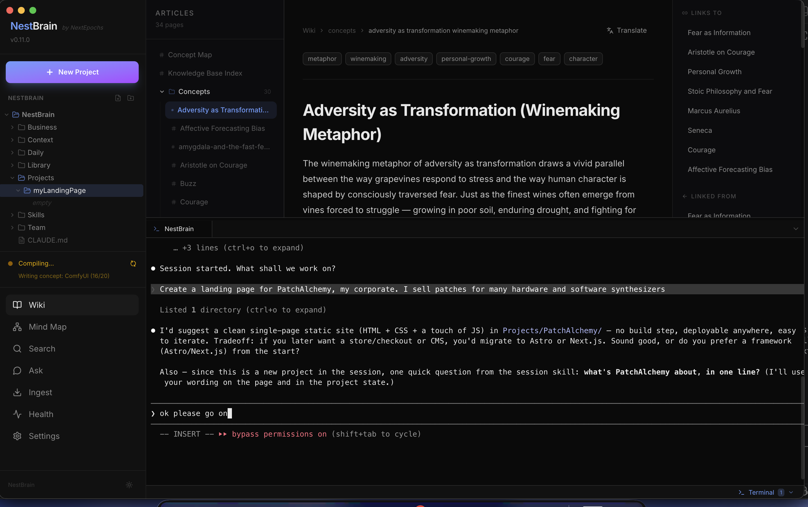
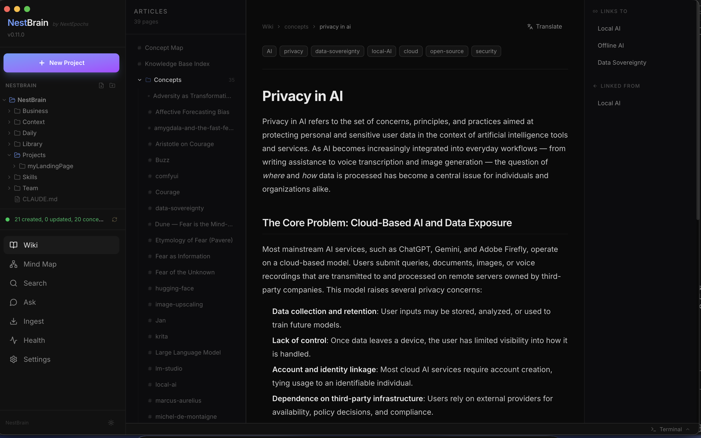
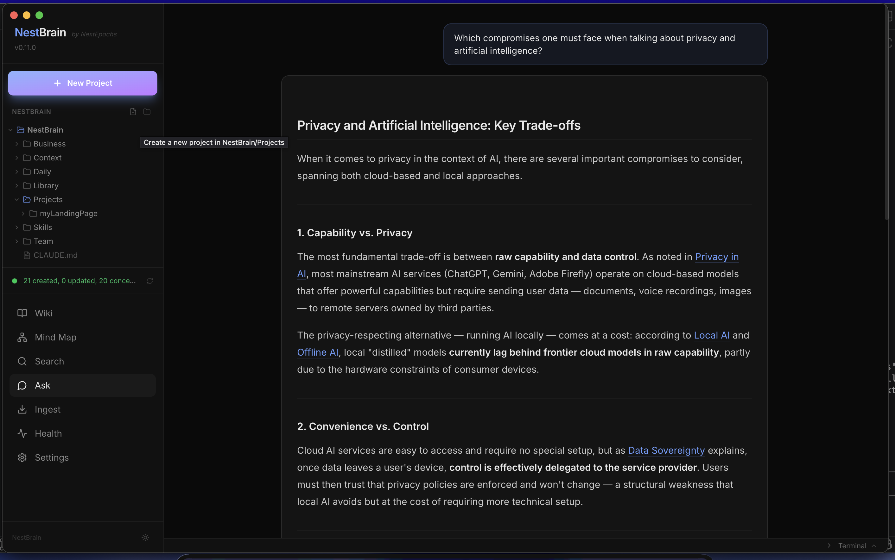
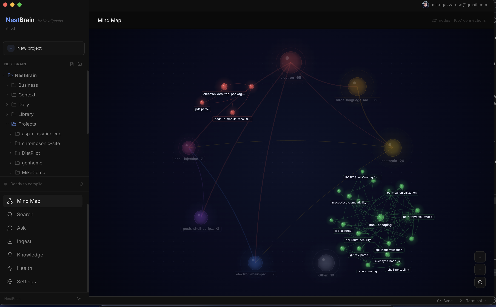
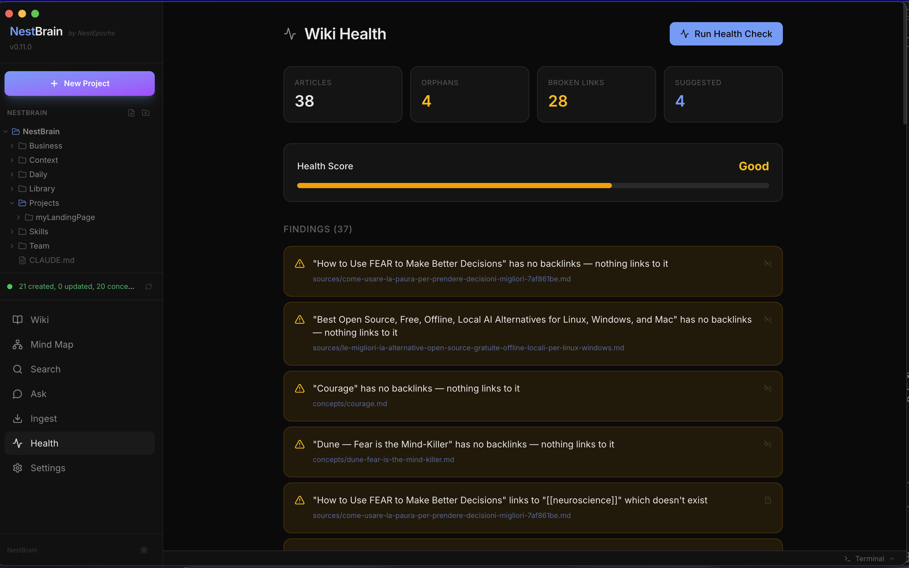

# NestBrain

**Your AI-powered second brain, packaged as a native workspace for people who actually build things.** Raw sources go in, a structured Markdown wiki comes out — compiled, linked, and maintained entirely by AI. Inside a full integrated workspace with a VS Code-style editor, a real terminal, and deep **Claude Code** integration that finally makes your LLM remember what you were doing yesterday.

   

🌐 **Website**: [nestbrain.app](https://nestbrain.app)



---

## Get NestBrain

NestBrain is **free and open source** under GPL-3.0. You can clone this repo and build the app from source yourself, at no cost, forever.

If you just want to **download, install, and start using it**, the **official signed binaries** are available as a one-time $29 license at **[nestbrain.app](https://nestbrain.app)** — the same app, pre-built and notarized, zero setup, directly funding continued development.

| | Free — Build from source | **⭐ Supporter License — $29** |
|---|---|---|
| **Price** | $0 | **$29 one-time. Forever.** |
| **Where** | This GitHub repo | [nestbrain.app](https://nestbrain.app) |
| **Source code** | ✅ Full GPL-3.0 source | ✅ Same GPL-3.0 source |
| **Features** | ✅ Everything below | ✅ Everything below |
| **Install time** | ~5 minutes (Node 20 + pnpm required) | **30 seconds — just open the DMG** |
| **Signed & notarized** | ❌ You have to strip quarantine manually | ✅ **Apple Developer ID signed + notarized** — opens cleanly on first launch |
| **Windows installer** | Build it yourself | ✅ **NSIS installer ready to run** |
| **Multi-device sync** | ✅ Via your own Google Drive | ✅ Via your own Google Drive |
| **Updates** | `git pull && pnpm desktop:build` | ✅ **Direct download from your account, forever** |
| **Support** | Community (GitHub issues) | ✅ Priority email support |

Both paths get you the **exact same product**. If you're comfortable running `pnpm install && pnpm desktop:package:mac`, you can have it for free in ~5 minutes. If you'd rather spend that time actually using the thing — and want to support an indie developer shipping quality software — buy the license at **[nestbrain.app](https://nestbrain.app)**. It's the same $29 you'd spend on two coffees, and it pays for weeks of continued work.

---

## What NestBrain does

NestBrain ingests raw documents — web pages, PDFs, GitHub repos, arXiv papers, YouTube transcripts, RSS feeds — and uses an LLM to compile them into an **interconnected wiki of Markdown files**. Everything lives inside a **NestBrain workspace** on your disk: browsable through a dark-mode native UI, compatible with Obsidian, queryable in natural language, and fully self-hostable.

But NestBrain is more than just a knowledge base. It's a **full integrated workspace** for knowledge workers and developers: a VS Code-style file tree, a built-in code editor, a real PTY terminal, and a session-aware AI assistant powered by **Claude Code** that actually remembers what you were doing across sessions, projects, and machines.

**You feed sources. The LLM builds and maintains the knowledge base. You explore, edit, code, and work alongside it — all in one window.**

---

## Why you'll love it

### 🧠 An AI that builds your wiki while you sleep
Drop any source — a URL, a PDF, a GitHub repo, an arXiv paper, a YouTube video, an RSS feed — and NestBrain compiles it into a beautifully linked wiki. Concepts connect automatically. Gaps surface. Every article has backlinks, citations, and a clean Markdown body you can open in Obsidian too.



### 💻 A real workspace, not just a viewer
- **VS Code-style file tree** with right-click rename/delete/new-file, auto-refreshed via native filesystem watchers (no manual refresh)
- **Built-in code editor** (CodeMirror 6) with syntax highlighting for ~100 languages, `Cmd/Ctrl+S` to save, dirty indicators, and unsaved-changes protection on tab close
- **Integrated terminal** — real PTY (xterm.js + node-pty), multi-session tabs, resizable bottom panel — a proper shell per project, right inside the app
- **New Project** creates `NestBrain/Projects/<name>` and opens a terminal session cwd'd into it, ready for `claude` or whatever your toolchain is

### 🤝 The first app that actually remembers your work
This is where NestBrain becomes something different. Every workspace ships with a **`CLAUDE.md`** and a **`Skills/`** directory copied automatically on first run, turning Claude Code into a session-aware coding partner that carries context across sessions, projects, and even machines.

Two skills drive this:

#### `start_session` — *"Good morning, Claude"*
Launch `claude` in any project directory, then say either trigger phrase. The skill will:

1. **Recap your previous session** — *"Yesterday you worked on…"* or *"In your previous session today you…"* — read directly from yesterday's session file plus the project's `.nest/STATE.md`
2. **Detect orphan sessions** — if you quit Claude Code without saying goodbye last time, the next session picks up the open log file and resumes it instead of starting fresh
3. **Start a new timestamped session log** in `NestBrain/Daily/YYYY-MM-DD_HH-MM-SS.md` and begin quietly recording macro-tasks as you work

No more explaining your project to Claude from scratch. No more pasting context. You just say "good morning" and pick up exactly where you left off.

#### `end_session` — *"Goodbye, Claude"*
When you're done for the day — or just done with this work block — say the trigger phrase. The skill will:

1. **Write a Summary** of what was done during the session
2. **Write a Next section** listing unfinished work and next steps, per-project
3. **Capture a compact Git snapshot** (branch, short hash, dirty file count) for every project touched
4. **Update `Projects/<name>/.nest/STATE.md`** for every project — this is the **context handoff file**: Purpose, Current status, Next up, Last touched

`.nest/STATE.md` is the magic. Next time you `cd` into that project on any machine (after a `git pull`) and say *"Buongiorno, Claude"* again, the skill reads the STATE file FIRST and immediately knows where to resume. Switch laptops, come back from vacation, hand work off to yourself a month later — the context is right there, written by the LLM for the LLM, in the project's git history.

**This is what makes NestBrain worth paying for.** You're not buying a knowledge base app. You're buying a workspace where your AI assistant finally has continuity.

### 📚 A proper knowledge base engine
- **Hybrid search** — semantic (local embeddings via all-MiniLM-L6-v2) + keyword, normalized and weighted
- **Q&A with citations** — natural-language questions grounded in your wiki, answers in your language, citations filtered to only what was actually referenced
- **Mind Map** — interactive radial graph of concept connections
- **Health Check** — LLM-powered wiki audit: orphans, broken links, stubs, gaps, inconsistencies
- **Incremental compilation** — only new/changed sources are processed, ~3–5 LLM calls per source regardless of total wiki size
- **Obsidian compatible** — `Library/Knowledge/` is a valid Obsidian vault; open it from Obsidian and work on the same data

#### Ask your knowledge base anything
Type a question in natural language. NestBrain runs hybrid search over your wiki, feeds relevant articles to the LLM as grounded context, and returns a structured answer with **only the citations the LLM actually used**. The answer is auto-saved back to the wiki so your questions become part of the knowledge base over time.



#### Explore concept connections visually
The Mind Map is an interactive radial graph of every concept in your wiki and how they link to each other. Click any node to jump straight to its article. Spot clusters, dead ends, and unexpected connections at a glance.



#### Keep your wiki clean with Health Check
NestBrain runs a full LLM-powered audit of your knowledge base: orphan articles (nothing links to them), broken links, stubs, content gaps, and inconsistencies. Every finding is actionable — click it and jump to the article.



### ☁️ Sync across every device you use
Sign in with Google and your NestBrain workspace stays in step on every machine: laptop, desktop, work, anywhere. Edits made on one PC arrive on the others within ~60 seconds — or instantly if you click "Sync now". The workspace lives in a dedicated `NestBrain-Sync/` folder inside **your own Google Drive**, and NestBrain uses the `drive.file` OAuth scope, which means the app can only see files NestBrain itself put there — never the rest of your Drive.

The whole thing is opt-in, per-device, and refuses to lose data:

- **Union model.** A delete on one machine never destroys data elsewhere — local deletes move to `.trash/`, which is also synced, so anything you remove is recoverable from any of your devices. Only an explicit "Delete on all devices…" with typed `DELETE` confirmation propagates a hard delete.
- **Keep-both on conflict.** Edit the same note on two machines while offline? Both versions are kept — your local file stays, the other arrives next to it as `foo.conflict-<timestamp>.md`. You decide what to merge.
- **Privacy by design.** OAuth refresh tokens are encrypted in the OS keychain (`Keychain` on macOS, `DPAPI` on Windows). Your OpenAI API key, NestBrain settings, the local vector index, and anything looking like `.env`/`secrets` are never uploaded.
- **Optional `Projects/`.** Your code projects can be excluded with one toggle. `node_modules`, `.git`, `dist`, `.next`, and friends are always excluded.

The full architecture — manifest format, conflict semantics, the `drive.file` trade-off, known limits — lives in [`docs/SYNC.md`](docs/SYNC.md).

### 🔒 Local-first, with optional sync — no cloud lock-in
All your data lives in `NestBrain/` on your disk. No account required to use the app. No telemetry. No vendor lock-in. You can quit NestBrain tomorrow and your knowledge base is still right there, in Markdown, usable by any other tool that understands `.md` files. If you want a NestBrain on a second machine, sign in with Google and turn on sync — your files stay on your devices and inside *your* Drive, never on a NestBrain server.

---

## How It Works

```
URL / PDF / GitHub / arXiv            Compiled Wiki
YouTube / RSS / .md                        │
     │                                     ▼
     ▼                              ┌──────────────┐
┌─────────┐    ┌──────────┐   ┌───▶│  Wiki Files  │
│  Ingest │───▶│ Compile  │───┤    │   (.md)      │
│ Pipeline│    │  (LLM)   │   │    └──────┬───────┘
└─────────┘    └──────────┘   │           │
                              │     ┌─────┼──────────────┐
                              │     ▼     ▼              ▼
                              │  ┌─────┐ ┌──────┐ ┌──────────┐
                              │  │Wiki │ │Mind  │ │  Health  │
                              │  │View │ │Map   │ │  Check   │
                              │  └─────┘ └──────┘ └──────────┘
                              │
                              └───▶ Vector Index
                                        │
                              ┌─────────┘
                              ▼
                       ┌────────────┐
                       │  Hybrid    │
                       │  Search    │──▶ Q&A ──▶ Auto-saved to wiki
                       └────────────┘
```

1. **Ingest** — URLs are fetched and converted to clean Markdown, PDFs are text-extracted, GitHub repos pull README + key files + tree, arXiv papers download full text, YouTube fetches transcripts, RSS feeds ingest multiple entries. Duplicates are detected and require confirmation.
2. **Compile** — The LLM processes only new/changed sources. For each, it generates a summary, extracts concepts, writes articles for new concepts (cross-linking to existing ones), embeds into the vector index, and regenerates master index and concept map.
3. **Ask & Explore** — Ask questions in natural language. Hybrid search finds relevant articles, the LLM answers with citations, the answer is auto-saved back to the wiki.

---

## Build from Source

The free path. Takes ~5 minutes if you have Node and pnpm installed.

### Prerequisites
- **Node.js 20+**
- **pnpm** (`npm install -g pnpm`)
- **Claude CLI** authenticated (`claude auth login`) **or** an OpenAI API key

### Google OAuth setup (only required if you want Sync)

NestBrain syncs through your own Google Drive, which means **each fork needs its own Google OAuth Desktop client** — we deliberately don't ship credentials in the repo so users of your build don't authenticate against someone else's Cloud project. (The supporter binaries from [nestbrain.app](https://nestbrain.app) ship with our credentials pre-configured.)

1. Go to [Google Cloud Console → Credentials](https://console.cloud.google.com/apis/credentials).
2. **Create credentials → OAuth client ID → Application type: Desktop app.** Copy the Client ID and the Client secret.
3. **OAuth consent screen → External**, in Testing mode for development. Add your Google account as a test user. Add the scopes `openid`, `email`, `profile`, `.../auth/drive.file`.
4. In your local clone:
   ```bash
   cp apps/desktop/src/auth/oauth-config.example.ts apps/desktop/src/auth/oauth-config.ts
   # then edit oauth-config.ts and paste in your Client ID + Client secret
   ```

`apps/desktop/src/auth/oauth-config.ts` is gitignored, so your credentials stay on your machine. You can skip these steps if you don't need Sync — the app still works for the local-only knowledge base.

### Run the native app in development mode
```bash
git clone git@github.com:mikegazzaruso/nestbrain.git
cd nestbrain
pnpm install
pnpm desktop:build
pnpm --filter @nestbrain/desktop start
```

On first launch the onboarding flow walks you through creating your `NestBrain/` workspace and choosing an LLM provider.

### Package a distributable binary yourself
```bash
pnpm desktop:package:mac    # → apps/desktop/release/*.dmg
pnpm desktop:package:win    # → apps/desktop/release/*.exe (NSIS installer)
```

Local builds use your own Apple keychain / Developer ID cert if present; otherwise they produce an **unsigned** binary. On macOS this triggers Gatekeeper's "damaged" warning — you'll need to strip the quarantine attribute before the first launch:

```bash
xattr -cr /Applications/NestBrain.app
```

(The paid Supporter License binaries from [nestbrain.app](https://nestbrain.app) are signed and notarized, so you don't need to do any of this — they just work.)

---

## LLM Providers

### Claude (default, recommended)
Uses your Claude subscription via the Claude CLI. No API costs, no bans — the native app spawns the CLI in the background.

```bash
claude auth login
```

NestBrain extends the packaged app's `PATH` at startup so the `claude` CLI is found even when installed in `~/.npm-global/bin`, `/opt/homebrew/bin`, or other non-default locations.

### OpenAI
Uses the OpenAI API. Configure your key in Settings.

Supports GPT-4o, GPT-4 Turbo, GPT-5, o1, o3, and o4 series. The provider automatically handles the `max_tokens` vs `max_completion_tokens` and `system` vs `developer` role differences across models.

---

## Supported Ingest Sources

| Source | Example | What's extracted |
|--------|---------|-----------------|
| Web URL | `https://example.com/article` | Clean article text + images |
| PDF | Upload a `.pdf` file | Full text extraction |
| Markdown | Upload a `.md` file | Direct copy with frontmatter |
| GitHub | `https://github.com/user/repo` | README, key files, file tree, metadata |
| arXiv | `https://arxiv.org/abs/2301.00001` | Abstract, full paper, metadata |
| YouTube | `https://youtube.com/watch?v=…` | Auto-generated transcript |
| RSS | `https://example.com/feed.xml` | Latest entries as individual sources |

---

## CLI

All the same commands work from the command line alongside the desktop app:

```bash
nestbrain ingest <source>       # Ingest any supported source
nestbrain compile               # Compile wiki (incremental)
nestbrain compile --force       # Recompile everything
nestbrain ask "your question"   # Ask with citations
nestbrain search "query"        # Hybrid search
nestbrain lint                  # Run the health check
nestbrain serve                 # Start the web UI
```

---

## Obsidian Compatibility

`NestBrain/Library/Knowledge/` is a fully compatible Obsidian vault out of the box:

- `[[wikilinks]]` work natively
- YAML frontmatter on every article
- Images with relative paths
- Graph view reveals the concept connections

Open `NestBrain/Library/Knowledge/` as a vault in Obsidian and work on the same knowledge base from both NestBrain and Obsidian at the same time. The compiler watches for changes.

---

## Configuration

Settings are managed through the **Settings** page in the app. App preferences are persisted in `NestBrain/.nestbrain/settings.json`:

- LLM provider (Claude CLI / OpenAI) and model
- OpenAI API key
- Auto-compile toggle
- Onboarding completion flag
- NestBrain workspace location (relocatable from Settings)
- Danger-zone wipe

**Sync & account state** lives separately, per-device, in your OS user data directory (so it doesn't travel with the workspace itself):

- **`<userData>/auth.enc`** — your Google OAuth refresh token, encrypted with the OS keychain via Electron `safeStorage`
- **`<userData>/sync-prefs.json`** — sync toggles (enabled, includeProjects, soft-limit, trash retention) for **this machine** only
- **`<workspace>/.nestbrain/sync-manifest.json`** — per-file sync state (MD5 + Drive id + mtime + size) used as the diff cache

Toggles available in Settings → Sync & Account:

- **Enable sync on this device** — master on/off
- **Include Projects/ folder** — opt-in for code projects (build artifacts always excluded)
- **Sign in / Sign out** with Google

The exact sync semantics — what gets uploaded, what's excluded, how deletes and conflicts behave — are documented in [`docs/SYNC.md`](docs/SYNC.md).

---

## Author

Created by **Mike Gazzaruso** ([NextEpochs](https://github.com/mikegazzaruso)) in 2026.
Copyright © 2026 NextEpochs. All rights reserved.

## License

This project is licensed under the [GNU General Public License v3.0](LICENSE).

If NestBrain saves you time or makes your work better, consider supporting development by picking up a license at **[nestbrain.app](https://nestbrain.app)**. It's the difference between a cool side project and something I can keep building full time.
